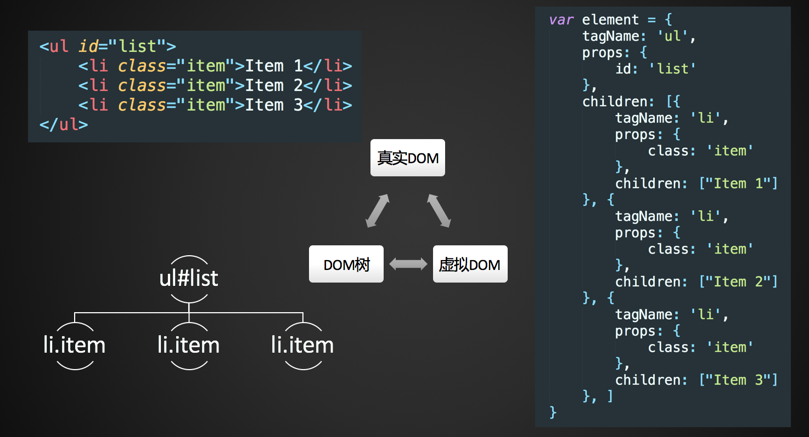
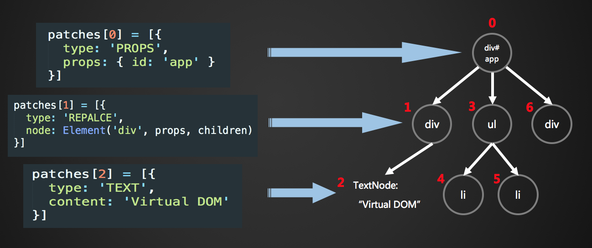

## DOM
> DOM（Document Object Model——文档对象模型）是用来呈现以及与任意 HTML 或 XML 交互的API文档。DOM 是载入到浏览器中的文档模型，它用节点树的形式来表现文档，每个节点代表文档的构成部分 —— MDN

--- 
### 页面解析流程
1. 解析HTML，构建DOM树
2. 解析CSS，生成CSS规则树
3. 合并DOM树和CSS规则，生成render树
4. 布局render树（Layout/reflow），负责各元素尺寸、位置的计算
5. 绘制render树（paint），绘制页面像素信息
6. 浏览器会将各层的信息发送给GPU，GPU会将各层合成（composite），显示在屏幕上

webkit内核的渲染流程

### 重排和重绘

- 重排 Reflow：重新生成布局
- 重绘 Repaint：重新绘制

**重排与重绘的关系**

重排一定会导致重绘，重绘不一定导致重排。如果DOM变化不影响几何属性，元素的布局没有改变，则只发生一次重绘（不需要重排）

**触发重排?**
1. 页面渲染初始化时；（这个无法避免）
2. 浏览器窗口改变尺寸；
3. 元素尺寸改变时；
4. 元素位置改变时；
5. 元素内容改变时；
6. 添加或删除可见的DOM 元素时

### DOM 优化

## MVVM

MVVM 是Model-View-ViewModel 的缩写，它是一种基于前端开发的架构模式，其核心是提供对View 和 ViewModel 的双向数据绑定，这使得ViewModel 的状态改变可以自动传递给 View，即所谓的数据双向绑定。

目的在于更清楚地将用户界面（UI）的开发与 应用程序中业务逻辑和行为的开发区分开来

### MVVM
- Model：真实状态内容的领域模型
- View：用户在屏幕上看到的结构、布局和外观（UI）
- viewModel：暴露公共属性和命令的视图的抽象
- 
### MVVM实现数据绑定
- 脏值检查（Angular）
- 数据劫持（Vue）

### Vue的MVVM实现原理
Vue.js采用数据劫持结合发布者-订阅者模式的方式，通过`Object.defineProperty()`来劫持各个属性的`setter`，`getter`，在数据变动时发布消息给订阅者，触发相应的监听回调。

1. 实现一个数据监听器Observer，能够对数据对象的所有属性进行监听，如有变动可拿到最新值并通知订阅者
2. 实现一个指令解析器Compile，对每个元素节点的指令进行扫描和解析，根据指令模板替换数据，以及绑定相应的更新函数
3. 实现一个Watcher，作为连接Observer和Compile的桥梁，能够订阅并收到每个属性变动的通知，执行指令绑定的相应回调函数，从而更新视图
4. mvvm入口函数，整合以上三者

## Virtual DOM
Virtual DOM 建立在 DOM 之上，是基于 DOM 的一层抽象，实际可理解为用更轻量的纯 JavaScript 对象（树）描述 DOM（树）

实现前提

- JavaScript执行很快
- 直接操作DOM很慢

### Virtual DOM 算法实现
1. 用 JavaScript 对象结构表示 DOM 树的结构；然后用这个树构建一个真正的 DOM 树，插到文档当中
2. 当状态变更的时候，重新构造一棵新的对象树。然后用新的树和旧的树进行比较，记录两棵树差异
3. 把2所记录的差异应用到步骤1所构建的真正的DOM树上，视图就更新了

#### 生成Virtual DOM树

- 节点类型
- 节点属性
- 子节点

#### 对比两棵树的差异

- 替换节点
- 增加/删除子节点
- 修改节点属性
- 改变文本内容

#### 更新视图

- replaceChild()
- appendChild()/removeChild()
- setAttribute()/removeAttribute()
- textContent

#### 实现DEMO

### Virtual DOM 与 DOM 对比

