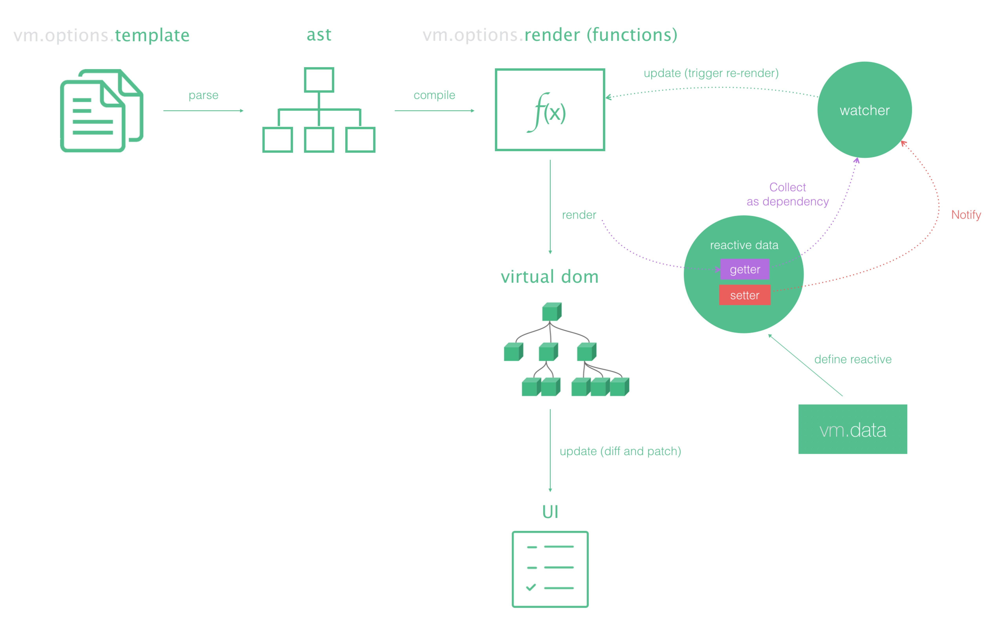

## Vue的MVVM实现原理

Vue.js采用数据劫持结合发布者-订阅者模式的方式，通过`Object.defineProperty()`来劫持各个属性的`setter`，`getter`，在数据变动时发布消息给订阅者，触发相应的监听回调。

1. 实现一个数据监听器Observer，能够对数据对象的所有属性进行监听，如有变动可拿到最新值并通知订阅者
2. 实现一个指令解析器Compile，对每个元素节点的指令进行扫描和解析，根据指令模板替换数据，以及绑定相应的更新函数
3. 实现一个Watcher，作为连接Observer和Compile的桥梁，能够订阅并收到每个属性变动的通知，执行指令绑定的相应回调函数，从而更新视图
4. mvvm入口函数，整合以上三者

[Object.defineProperty()](https://developer.mozilla.org/zh-CN/docs/Web/JavaScript/Reference/Global_Objects/Object/defineProperty)

---

## Vue渲染过程

---