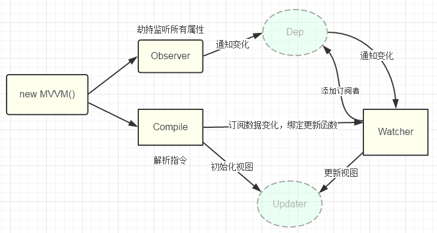

## DOM
> DOM（Document Object Model——文档对象模型）是用来呈现以及与任意 HTML 或 XML 交互的API文档。DOM 是载入到浏览器中的文档模型，它用节点树的形式来表现文档，每个节点代表文档的构成部分 —— MDN

--- 

## 页面解析流程

<font size=4>

1. 解析HTML，构建DOM树
2. 解析CSS，生成CSS规则树
3. 合并DOM树和CSS规则，生成render树
4. 布局render树（Layout/reflow），负责各元素尺寸、位置的计算
5. 绘制render树（paint），绘制页面像素信息
6. 浏览器会将各层的信息发送给GPU，GPU会将各层合成（composite），显示在屏幕上

</font>


<center><font size=5>webkit内核的渲染流程</font></center>

---

## 重排和重绘


- 重排 Reflow：重新生成布局
- 重绘 Repaint：重新绘制

<font size=5>

**重排与重绘的关系**

重排一定会导致重绘，重绘不一定导致重排

**触发重排?**
1. 页面渲染初始化时；（这个无法避免）
2. 浏览器窗口改变尺寸；
3. 元素尺寸改变时；
4. 元素位置改变时；
5. 元素内容改变时；
6. 添加或删除可见的DOM 元素时

</font>

---

## DOM 优化

[重绘、重排与浏览器优化方法](https://juejin.im/post/5c7f80f4e51d4541c00218b0)


---


## Virtual DOM
Virtual DOM 建立在 DOM 之上，是基于 DOM 的一层抽象，实际可理解为用更轻量的纯 JavaScript 对象（树）描述 DOM（树）

实现前提

- JavaScript执行很快
- 直接操作DOM很慢

---


## Virtual DOM 算法实现
1. 用 JavaScript 对象结构表示 DOM 树的结构；然后用这个树构建一个真正的 DOM 树，插到文档当中
2. 当状态变更的时候，重新构造一棵新的对象树。然后用新的树和旧的树进行比较，记录两棵树差异
3. 把2所记录的差异应用到步骤1所构建的真正的DOM树上，视图就更新了

---


## 生成Virtual DOM树

- 节点类型
- 节点属性
- 子节点


---

## 对比两棵树的差异

- 替换节点
- 增加/删除子节点
- 修改节点属性
- 改变文本内容


---

## 更新视图

- replaceChild()
- appendChild()/removeChild()
- setAttribute()/removeAttribute()
- textContent


---


## Virtual DOM 实现Demo

<font size=5>

```
// 1. 构建虚拟DOM
var tree = el('div', {'id': 'container'}, [
    el('h1', {style: 'color: blue'}, ['simple virtal dom']),
    el('p', ['Hello, virtual-dom']),
    el('ul', [el('li')])
])

// 2. 通过虚拟DOM构建真正的DOM
var root = tree.render()
document.body.appendChild(root)

// 3. 生成新的虚拟DOM
var newTree = el('div', {'id': 'container'}, [
    el('h1', {style: 'color: red'}, ['simple virtal dom']),
    el('p', ['Hello, virtual-dom']),
    el('ul', [el('li'), el('li')])
])

// 4. 比较两棵虚拟DOM树的不同
var patches = diff(tree, newTree)

// 5. 在真正的DOM元素上应用变更
patch(root, patches)
```

</font>

---


## Virtual DOM 与 DOM 对比

- **性能？**
- 组件的高度抽象化
- 为函数式的 UI 编程方式打开了大门
- 实现 SSR、同构渲染（如Weex）

---

## MVVM

<font size=5>

MVVM 是Model-View-ViewModel 的缩写，它是一种基于前端开发的架构模式，其核心是提供对View 和 ViewModel 的双向数据绑定，这使得ViewModel 的状态改变可以自动传递给 View，即所谓的数据双向绑定。


**目的在于更清楚地将用户界面（UI）的开发与 应用程序中业务逻辑和行为的开发区分开来**

</font>

---

## MVVM

- Model：真实状态内容的领域模型
- View：用户在屏幕上看到的结构、布局和外观（UI）
- viewModel：暴露公共属性和命令的视图的抽象


## MVVM实现数据绑定
- 脏值检查（Angular）
- 数据劫持（Vue）

---

## Vue的MVVM实现原理

<font size=4>

Vue.js采用数据劫持结合发布者-订阅者模式的方式，通过`Object.defineProperty()`来劫持各个属性的`setter`，`getter`，在数据变动时发布消息给订阅者，触发相应的监听回调。



1. 实现一个数据监听器Observer，能够对数据对象的所有属性进行监听，如有变动可拿到最新值并通知订阅者
2. 实现一个指令解析器Compile，对每个元素节点的指令进行扫描和解析，根据指令模板替换数据，以及绑定相应的更新函数
3. 实现一个Watcher，作为连接Observer和Compile的桥梁，能够订阅并收到每个属性变动的通知，执行指令绑定的相应回调函数，从而更新视图
4. mvvm入口函数，整合以上三者

[Object.defineProperty()](https://developer.mozilla.org/zh-CN/docs/Web/JavaScript/Reference/Global_Objects/Object/defineProperty)

</font>

---

## Vue渲染过程


---

## 参考
[重排与重绘](https://github.com/cunxu/Blog/issues/6)
[重绘、重排与浏览器优化方法](https://juejin.im/post/5c7f80f4e51d4541c00218b0)
[Vue 模板编译原理](https://github.com/berwin/Blog/issues/18)
[理解 Virtual DOM](https://github.com/y8n/blog/issues/5)
[如何实现一个 Virtual DOM 算法](https://github.com/livoras/blog/issues/13)
[浅谈 MVC、MVP 和 MVVM 架构模式](https://draveness.me/mvx)
[mvvm实现](https://github.com/DMQ/mvvm)


