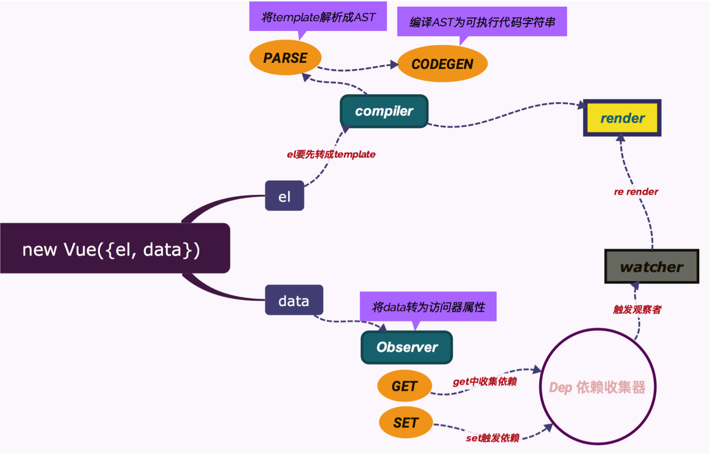

## DOM
> DOM（Document Object Model——文档对象模型）是用来呈现以及与任意 HTML 或 XML 交互的API文档。DOM 是载入到浏览器中的文档模型，它用节点树的形式来表现文档，每个节点代表文档的构成部分 —— MDN

--- 

## 页面解析流程

<font size=4>

1. 解析HTML，构建DOM树
2. 解析CSS，生成CSS规则树
3. 合并DOM树和CSS规则，生成render树
4. 布局render树（Layout/reflow），负责各元素尺寸、位置的计算
5. 绘制render树（paint），绘制页面像素信息
6. 浏览器会将各层的信息发送给GPU，GPU会将各层合成（composite），显示在屏幕上

</font>


<center><font size=5>webkit内核的渲染流程</font></center>

---

## 重排和重绘


- 重排 Reflow：重新生成布局
- 重绘 Repaint：重新绘制

<font size=5>

**重排与重绘的关系**

重排一定会导致重绘，重绘不一定导致重排

**触发重排?**
1. 页面渲染初始化时；（这个无法避免）
2. 浏览器窗口改变尺寸；
3. 元素尺寸改变时；
4. 元素位置改变时；
5. 元素内容改变时；
6. 添加或删除可见的DOM 元素时

</font>

---

## DOM 优化

[重绘、重排与浏览器优化方法](https://juejin.im/post/5c7f80f4e51d4541c00218b0)


---


## MVVM

<font size=5>

MVVM 是Model-View-ViewModel 的缩写，它是一种基于前端开发的架构模式，其核心是提供对View 和 ViewModel 的双向数据绑定，这使得ViewModel 的状态改变可以自动传递给 View，即所谓的数据双向绑定。


**目的在于更清楚地将用户界面（UI）的开发与 应用程序中业务逻辑和行为的开发区分开来**

</font>

---

## MVVM


- Model：真实状态内容的领域模型
- View：用户在屏幕上看到的结构、布局和外观（UI）
- viewModel：暴露公共属性和命令的视图的抽象


<font size=4>

```
    <!--上图中的 View 部分-->
    <div id="app">
        <p>{{price}} 元</p>
        <button v-on:click="addHandle">add</button>
    </div>
    
    <script type="text/javascript">
        /* 上图中的Model */
        var model = {
            price: 100
        }
        
        /* 上图中的 ViewModel */
        var vm = new Vue({
            el: '#app',
            data: model,
            methods: {
                addHandle: function () {
                    this.price++
                }
            }
        })
    </script>
```


</font>

---


## Vue2的MVVM

<font size=5>

- 响应式: 实现一种观察者模式。在初始化页面的时候，监听 Model 中的数据，一旦有变化，立即触发通知，更新 View


- 模板引擎：模板语法是一段 html 代码片段，但有很多 vue 定义的指令(v-on v-model 等)，模板引擎会把一个 html 片段最终解析成一个 JS 函数，让它真正动起来。

- 虚拟 DOM：Model 中的数据一旦有变化，就会重新渲染 View，如果是直接去操作 DOM 修改 View 就很难做到性能的极致，而 vdom 就能做到，vdom 进行 diff 之后，再决定要真正修改哪些 DOM 节点

</font>

---

## Vue2 整体流程图



---

## 响应式


- 对象监听： [Object.defineProperty()](https://developer.mozilla.org/zh-CN/docs/Web/JavaScript/Reference/Global_Objects/Object/defineProperty)
- 数据监听：直接修改需要监听的数组的原型
- Observer 
- walk
- defineReactive
- Dep

---

## 模板解析

<font size=5>

1. 将模板处理为 AST，即抽象语法树（Abstract Syntax Tree）

2. 优化 AST ，找到最大静态子树, 为了提高后面更新 View 的效率

3. 生成 render 函数，将模板字符串转换为 JS 真正可执行的函数


</font>


---

## Virtual DOM
Virtual DOM 建立在 DOM 之上，是基于 DOM 的一层抽象，实际可理解为用更轻量的纯 JavaScript 对象（树）描述 DOM（树）

实现前提

- JavaScript执行很快
- 直接操作DOM很慢

---


## Virtual DOM 算法实现
1. 用 JavaScript 对象结构表示 DOM 树的结构；然后用这个树构建一个真正的 DOM 树，插到文档当中
2. 当状态变更的时候，重新构造一棵新的对象树。然后用新的树和旧的树进行比较，记录两棵树差异
3. 把2所记录的差异应用到步骤1所构建的真正的DOM树上，视图就更新了

---


## 生成Virtual DOM树

- 节点类型
- 节点属性
- 子节点


---

## 对比两棵树的差异

- 替换节点
- 增加/删除子节点
- 修改节点属性
- 改变文本内容


---

## 更新视图

- replaceChild()
- appendChild()/removeChild()
- setAttribute()/removeAttribute()
- textContent


---

## Vue VDom

- 解析模板最终生成 render 函数。
- 初次渲染时，直接执行 render 函数。render 函数会生成 vnode ，然后 patch 到真实的 DOM 中，完成 View 的渲染。
- Model 属性发生变化时，触发通知，重新执行 render 函数，生成 newVnode ，然后patch(vnode, newVnode)，针对两者进行 diff 算法，最终将有区别的部分重新渲染。
- Model 属性再次发生变化时，又会触发通知 ……

---

## Virtual DOM 与 DOM 对比

- **性能？**
- 组件的高度抽象化
- 为函数式的 UI 编程方式打开了大门
- 实现 SSR、同构渲染（如Weex）

---

## 参考
[重排与重绘](https://github.com/cunxu/Blog/issues/6)
[重绘、重排与浏览器优化方法](https://juejin.im/post/5c7f80f4e51d4541c00218b0)
[Vue 模板编译原理](https://github.com/berwin/Blog/issues/18)
[理解 Virtual DOM](https://github.com/y8n/blog/issues/5)
[如何实现一个 Virtual DOM 算法](https://github.com/livoras/blog/issues/13)
[浅谈 MVC、MVP 和 MVVM 架构模式](https://draveness.me/mvx)
[mvvm实现](https://github.com/DMQ/mvvm)
[Vue2 MVVM原理](https://github.com/wangfupeng1988/learn-vue2-mvvm)


